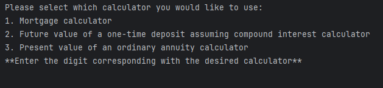
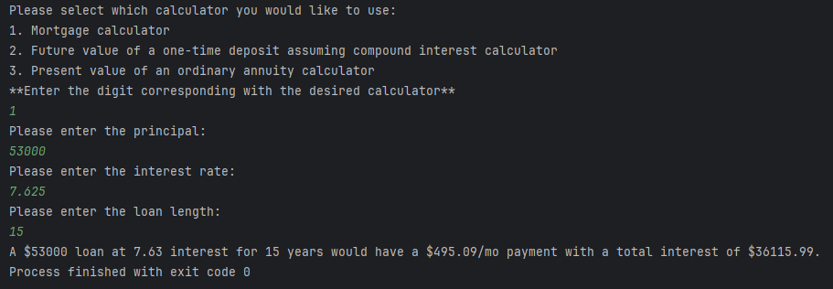
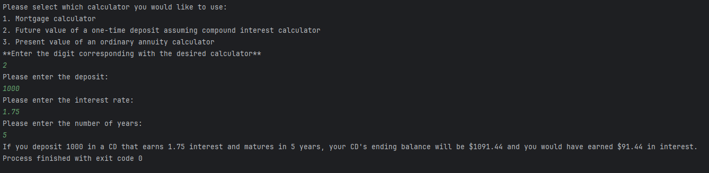
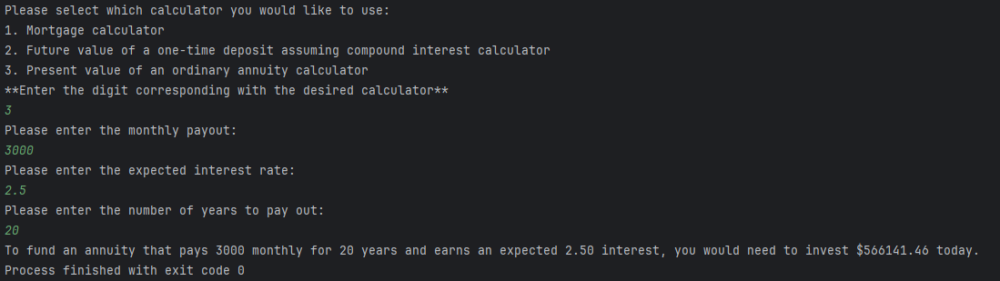

# financial-calculators
### YUU workbook-1 workshop project
## A simple. console-based Java application that allows the user to perform three financial calculations:
1. **mortgage calculator**: calculates expected monthly payments and total interest paid, baased on principal, interest rate and loan length
2. **future value of a one-time deposit**: determines the future value of a one-time deposit assuming compound interest and the total interest earned, using the deposit, interest rate, and number of years
3. **ordinary annuity calculator**: calculates the present value of an annuity based on the monthly payout, expected interest rate, and years to pay out from the user

## Screenshots
#### Main Menu

#### Mortgage Calculator

#### Future Value of a One-Time Deposit

#### Ordinary Annuity Calculator

